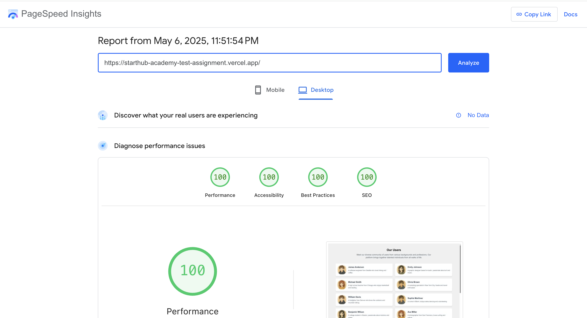

# StartHub Academy Test Assignment

## Live Link
[View Live Demo](https://starthub-academy-test-assignment.vercel.app/)

## Installation Steps
```bash
git clone git@github.com:daminisherathiya/starthub-academy-test-assignment.git
cd starthub-academy-test-assignment
npm i
npm run dev
```

Once running, we can access the application at: http://localhost:3000

## Performance

Leveraged NextJS's capabilities and achieved top-notch performance scores
- Leveraged NextJS's server-side rendering (SSR) capabilities
- Leveraged NextJS's components like <Image> and <Link>
- ...

Results from [Google PageSpeed Insights](https://pagespeed.web.dev/analysis/https-starthub-academy-test-assignment-vercel-app/8rmot3wcnr?form_factor=desktop)
- **Performance: 100 / 100**
- **Accessibility: 100 / 100**
- **Best Practices: 100 / 100**
- **SEO: 100 / 100**



## A brief explanation of SEO Optimizations and WCAG Compliance
- The title and description are generated dynamically using NextJS's generateMetadata() function (Upon each page load, we can see different title)
- The page is rendered server-side using NextJS's server-side rendering (SSR) capabilities
- The page is mobile-friendly and responsive on all screen sizes
- Proper Meta tags including title, description, and Open Graph tags are used
- The page speed is very good
- Proper HTML semantic structure is used
- Proper alt text for images are used
- Basic navigation support like hitting tab selects the next user and hitting enter opens the currently focused user (similar to click behaviour)
- ...
